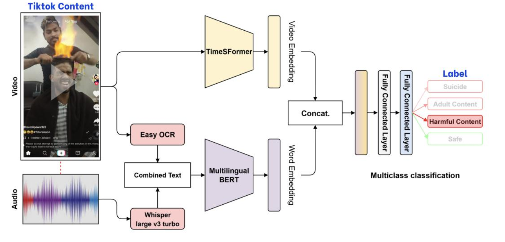
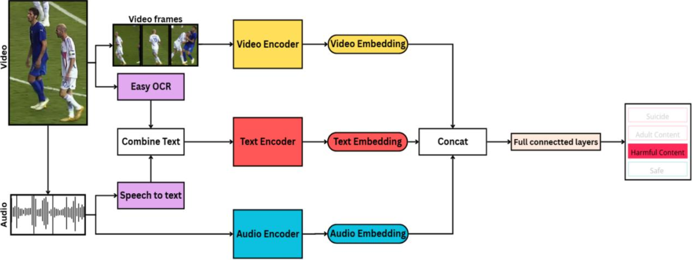
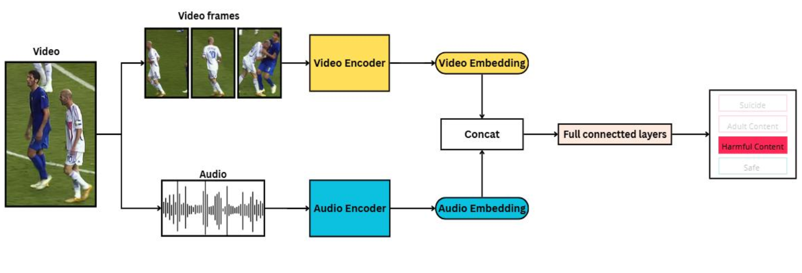
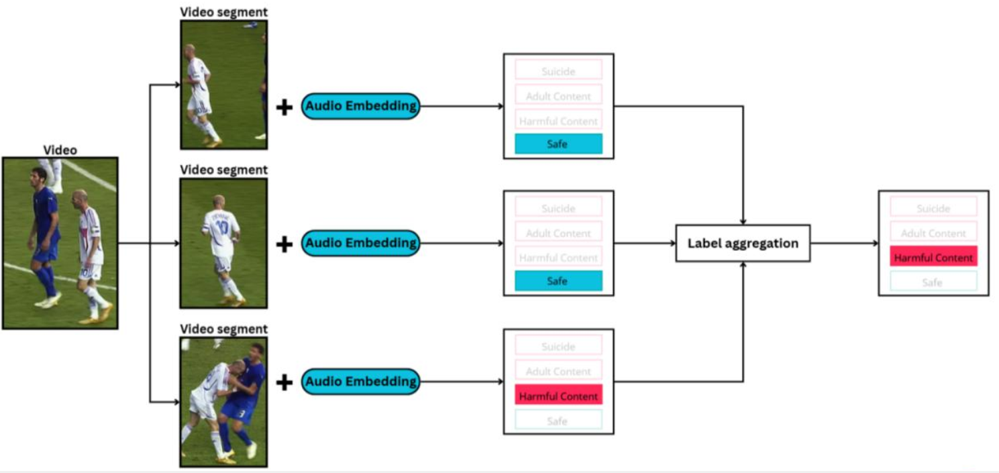
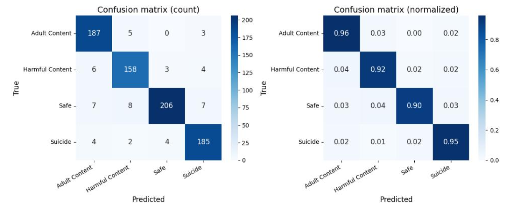

# A Multimodal Pipeline for Classifying TikTok Videos by Child-Safety Level

This repository accompanies a research study on **multimodal deep learning for child-safety content classification on TikTok**, classifying videos into four levels: **Safe, Adult Content, Harmful Content, and Suicide**.

> **Note on repository scope:** This repository hosts a selection of the notebooks used during the research (training experiments and supplementary content analysis). It is not a packaged, end-to-end software release — some code, intermediate artifacts, and the processed dataset used in the study have not been published here.

## Research Summary

Short-video platforms such as TikTok make it easy for harmful content (dangerous challenges, violence, sexual content, self-harm/suicide-related material) to reach children and teenagers at scale. This study investigates and improves a multimodal classification pipeline for this problem, building on the **MTikGuard** reference system and the **Extended TikHarm** dataset.

The research was organized around three directions:
1. **Data quality improvement:** manually reviewing and correcting mislabeled/overlapping samples in Extended TikHarm.
2. **Multimodal feature experimentation:** comparing visual, audio, ASR-text, and OCR-text features, and different fusion strategies.
3. **Long-video handling:** sampling and segmentation strategies to avoid missing harmful signals confined to short segments of long videos.

The best configuration identified (**TimeSformer long + WavLM large, trained on the re-labeled data, with video segmentation applied at inference**) reached **test macro F1 = 93.23 / accuracy = 93.28**, compared with **88.44 / 88.48** for the reproduced reference-paper baseline.

## Dataset

**Extended TikHarm** (published together with the reference paper, MTikGuard), 4,723 TikTok videos, single-label across 4 classes:

| Split | Samples | Rate |
|---|---|---|
| Train | 3,418 | 72.4% |
| Validation | 515 | 10.9% |
| Test | 790 | 16.7% |

| Label | Samples | Rate |
|---|---|---|
| Safe | 1,248 | 26.4% |
| Harmful Content | 1,193 | 25.3% |
| Adult Content | 1,141 | 24.2% |
| Suicide | 1,141 | 24.2% |

Video duration varies widely (up to 600 seconds for Adult Content / Harmful Content), which motivated the long-video sampling and segmentation work described below.

## Methodology

**Baseline (reproduced from the reference paper):** TimeSformer base (8 frames) for visual features + Multilingual BERT for text features (ASR via Whisper large-v3 + OCR via EasyOCR), combined with late fusion / attention-based fusion.


**Improvements studied in this research:**
- **Audio feature encoders:** replacing "speech-to-text only" processing with direct audio embeddings, comparing **CLAP**, **WavLM large**, and **Whisper large-v3** (encoder only) as audio backbones.
- **Training strategies:** frozen encoders vs. fully unfrozen fine-tuning vs. layerwise learning rate vs. multi-head attention fusion in place of the fusion block.
- **Video encoder upgrade:** TimeSformer base (8 frames) → **TimeSformer long (96 frames)**.
- **Manual data re-labeling:** systematic review of all 4,723 videos to correct mislabeled/overlapping samples.
- **Video segmentation at inference** long videos are split into clips (duration-based threshold table), each clip is classified independently, and results are aggregated via a priority rule (harmful labels > frequency of occurrence > earliest occurrence).

Models involved: **TimeSformer** (visual), **CLAP / WavLM / Whisper large-v3** (audio), **Multilingual BERT / BGE-M3** (text, used in baseline reproduction and in the supplementary hashtag-clustering analysis).

## Results

**Reproduction of the reference pipeline:**

| Name | Language Model | Video Model | Val Acc. | Val F1 | Test Acc. | Test F1 |
|---|---|---|---|---|---|---|
| Reproduce best | Multilingual BERT | TimeSformer base | 80.78 | 80.77 | 88.35 | 88.31 |
| Reproduce best [attention fusion] | Multilingual BERT | TimeSformer base | 79.61 | 79.35 | 86.07 | 85.98 |

**Audio + Video + Text (original labels):**

*Audio Video Text pipeline*

| Name | Text Model | Video Model | Audio Model | Test Acc. | Test F1 |
|---|---|---|---|---|---|
| AVT Base | Multilingual BERT | TimeSformer base | Whisper large-v3 | 86.97 | 86.93 |

**Audio + Video, original labels:**

*Audio Video pipeline*

| Name | Video Model | Audio Model | Test Acc. | Test F1 |
|---|---|---|---|---|
| AV Base | TimeSformer base | Larger CLAP general | 88.48 | 88.46 |
| AV Base | TimeSformer base | WavLM large | 88.86 | 88.81 |
| AV Base | TimeSformer base | Whisper large-v3 | 87.46 | 87.39 |
| AV Unfreeze | TimeSformer base | WavLM large | 88.47 | 88.45 |
| AV Layerwise LR | TimeSformer base | WavLM large | 88.59 | 88.50 |
| AV Base [attention fusion] | TimeSformer base | WavLM large | 86.69 | 86.64 |
| **AV Best** | **TimeSformer long** | **WavLM large** | **89.35** | **89.29** |

**Audio + Video, after data re-labeling:**

| Name | Video Model | Audio Model | Test Acc. | Test F1 |
|---|---|---|---|---|
| AV Relabel | TimeSformer long | WavLM large | 90.87 | 90.86 |


*Inference (video slicing) pipeline*


| Name | Video Model | Audio Model | Test Acc. | Test F1 |
| **AV SlicingVideo** (video segmentation) | **TimeSformer long** | **WavLM large** | **93.28** | **93.23** |


**Single-modality contribution (audio-only vs. text extracted from audio/frame):**

| Modality | Test Acc. | Test F1 |
|---|---|---|
| Audio (WavLM large) | 53.84 | 53.31 |
| ASR text (reference paper) | 50.51 | 50.26 |
| OCR text (reference paper) | 36.20 | 30.52 |
| Video only | 87.97 | 87.90 |

- WavLM large, used as a direct audio encoder, consistently outperforms speech-to-text (Whisper) and OCR-based text features, non-verbal audio cues (tone, background sound) carry useful signal that ASR discards.
- Fully unfreezing encoders or replacing the fusion block with multi-head attention did not outperform the simple frozen-encoder + concatenation fusion setup under this experimental configuration; both showed signs of overfitting.

## Conclusion

The final pipeline: **TimeSformer long (96 frames) + WavLM large, trained on the re-labeled dataset, with video segmentation applied at inference** is the best-performing configuration identified in this study:

| | Reference paper's published result [1] | Final proposed pipeline | Improvement |
|---|---|---|---|
| Test Accuracy | 88.48 | **93.28** | **+4.80** |
| Test Macro F1 | 88.44 | **93.23** | **+4.79** |

(Note: the thesis's own reproduction of the reference pipeline, without the paper's unpublished attention-fusion details, reached a slightly lower test macro F1 of 88.31, this reproduced baseline is what individual experiments in the Results tables above are compared against; the table here uses the reference paper's own published numbers, matching the comparison made in the thesis's final conclusion.)

This ~4.8-point gain over the reproduced reference baseline came from three improvements:

- **Encoding audio directly instead of via speech-to-text:** (WavLM large replacing the Whisper-transcript + text-embedding approach), retains non-verbal audio cues (tone, background sound) that speech recognition discards, and already outperforms the baseline on its own (test F1 89.29 with TimeSformer long, before any label correction).
- **Manually re-labeling the dataset:** correcting mislabeled/overlapping samples (concentrated in Harmful Content) improved macro F1 by **+1.57 points** using the exact same architecture and hyperparameters, confirming that label quality was a real, measurable bottleneck rather than a modeling limitation.
- **Video segmentation at inference:** splitting long videos into clips and aggregating predictions with a harm-priority rule improved macro F1 by a further **+2.37 points**, with no re-training required. This was the single largest improvement in the study and is the most practically reusable, since it can be applied to any existing video classification pipeline without changing its architecture.

.png)
*Confusion matrix of the best model before relable.*

.png)
*Confusion matrix of the best model after relable.*


*Confusion matrix of the best model with video slicing applied at inference.*

Per-class recognition also improved consistently after re-labeling and segmentation: all four classes reached **above 90% accuracy** in the confusion matrix of the final pipeline, compared to a low of 82% (Harmful Content) before re-labeling and segmentation were applied. Harmful Content, the class the reference paper itself flagged as most error-prone, improved from 82% (before re-labeling) to 89% (after re-labeling) to 92% (after also applying video segmentation).

The study was carried out as a controlled ablation: each component (audio encoder, video encoder, training strategy, label quality, inference strategy) was changed and evaluated independently, so the contribution of each improvement to the final result is individually verifiable rather than only observable in aggregate. Experiments that did not help full fine-tuning, layerwise learning rate, and multi-head attention fusion are reported alongside the ones that did, for transparency.

## Limitations

- All experiments use a single dataset (Extended TikHarm); generalization to other platforms or content distributions was not evaluated.
- The video segmentation strategy is a duration-based heuristic applied only at inference time, not during training.
- The task is framed as single-label classification, even though some videos may exhibit characteristics of multiple classes.

## Repository Contents

```text
TikTok_Classification/
│
├── training/                        # Multimodal classification experiments
│   ├── baseline.ipynb                     # Reproduction of the reference pipeline
│   ├── audio_video.ipynb                  # Audio + video fusion pipeline
│   ├── audio_video_96frame.ipynb          # TimeSformer long (96-frame) variant
│   ├── audio_video_battn.ipynb            # Attention-based fusion variant
│   ├── audio_video_layerwise-LR.ipynb     # Layerwise learning-rate fine-tuning
│   ├── audio_video_unfreeze.ipynb         # Fully unfrozen fine-tuning
│   ├── audio_video_text.ipynb             # Audio + video + text pipeline
│   ├── video_text.ipynb                   # Video + text pipeline
│   └── clustered_hashtags.ipynb           # Hashtag-based data analysis
│
├──  sentiment_analysist/             # Supplementary data/content analysis
│    ├── caption_analysist.ipynb            # Caption text analysis
│    ├── comment_analysist.ipynb            # Comment sentiment/keyword analysis
│    ├── kmeans_clustering.ipynb            # K-means clustering of hashtags/embeddings
│    ├── hierachical_clustering.ipynb       # Hierarchical clustering of hashtags/embeddings
│    └── test_groq_for_hashtag_normaliztion.ipynb  # Hashtag normalization experiment
│
└──  image/                           # pipelines/confusion matrix
     ├── Audio-Video-Text.png               # Audio-Video-Text pipeline
     ├── Audio-Video.png                    # Audio-Video pipeline
     ├── Baseline.png                       # Paper's pipeline
     ├── Inference.png                      # Inference pipeline
     ├── cm_best (after relable).png        # Confusion matrix of best model after relable
     ├── cm_best (before relable).png       # Confusion matrix of best model before relable
     └── cm_slicingVideo.png                # Confusion matrix of best model after relable applied slicingvideo
```

## Technologies

- **Python**, **Jupyter Notebook** (Kaggle / Google Colab)
- **PyTorch**, **HuggingFace Transformers**
- **TimeSformer** (video), **WavLM / CLAP / Whisper large-v3** (audio), **Multilingual BERT / BGE-M3** (text)
- **scikit-learn** (metrics, clustering), **OpenCV** (video frame extraction), **pandas / NumPy**
- **sentence-transformers**, **underthesea** (Vietnamese NLP), **WordCloud**
- Training GPU: **NVIDIA RTX A6000** (total reported training cost ≈ 900,000 VND)

## Reference

[1] MTikGuard System: A Transformer-Based Multimodal System for Child-Safe Content Moderation on TikTok.

## Authors

- Trần Trí Tân
- Đỗ Nhật Nam

